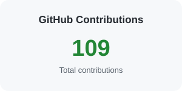

<h1 align="center">Hi 👋, I'm Vaibhav Agarwal</h1>

<h3 align="center">
  Java Developer | Spring Boot | Microservices | Apache Kafka | AWS
</h3>

  Building scalable backend systems, REST APIs and event-driven applications.

  
  
  

---

## 👨‍💻 About Me

I'm a software developer focused on building **scalable, maintainable and production-oriented applications** using the Java ecosystem.

- ☕ Strong focus on **Java & Spring Boot**
- 🔗 Building **REST APIs & Microservices**
- 📨 Working with **Apache Kafka & event-driven architecture**
- ☁️ Exploring **AWS and cloud-native development**
- 🔐 Working with **Spring Security**
- 🗄️ Working with **SQL and NoSQL databases**
- ⚛️ Familiar with **React.js** for frontend development
- 🤖 Using AI-assisted development tools such as **GitHub Copilot & Cursor**
- 🧩 Practicing **Data Structures & Algorithms**

---

## 🛠️ Technical Skills

### ☕ Java & Backend

  
  <b> Java</b>
  &nbsp;&nbsp;&nbsp;

  
  <b> Spring Boot</b>
  &nbsp;&nbsp;&nbsp;

  
  <b> Apache Kafka</b>

  <b>REST APIs</b>
  &nbsp; • &nbsp;
  <b>Microservices</b>
  &nbsp; • &nbsp;
  <b>Spring Security</b>
  &nbsp; • &nbsp;
  <b>Hibernate</b>
  &nbsp; • &nbsp;
  <b>JPA</b>
  &nbsp; • &nbsp;
  <b>JDBC</b>

---

### 🗄️ Databases & Caching

  
  <b> MySQL</b>
  &nbsp;&nbsp;&nbsp;

  
  <b> PostgreSQL</b>
  &nbsp;&nbsp;&nbsp;

  
  <b> MongoDB</b>
  &nbsp;&nbsp;&nbsp;

  
  <b> Redis</b>

---

### ☁️ Cloud, DevOps & Tools

  
  <b> AWS</b>
  &nbsp;&nbsp;&nbsp;

  
  <b> Docker</b>
  &nbsp;&nbsp;&nbsp;

  
  <b> Git</b>
  &nbsp;&nbsp;&nbsp;

  
  <b> GitHub</b>
  &nbsp;&nbsp;&nbsp;

  
  <b> Maven</b>

---

### ⚛️ Frontend

  
  <b> React.js</b>
  &nbsp;&nbsp;&nbsp;

  
  <b> JavaScript</b>
  &nbsp;&nbsp;&nbsp;

  
  <b> HTML5</b>
  &nbsp;&nbsp;&nbsp;

  
  <b> CSS3</b>

---

### 🤖 AI-Assisted Development

  
  &nbsp;
  

---

## 🚀 Featured Projects

<table>
<tr>

<td width="33%" valign="top">

### 🔗 URL Shortener

A Spring Boot application for creating and managing shortened URLs.

**Tech Stack**

Java  
Spring Boot  
REST API  
PostgreSQL

</td>

<td width="33%" valign="top">

### 📨 Notification System

An event-driven notification system with asynchronous processing, Kafka messaging, retry handling and failure management.

**Tech Stack**

Java  
Spring Boot  
Apache Kafka  
PostgreSQL  
Docker

</td>

<td width="33%" valign="top">

### 🛒 E-Commerce Microservices

A microservices-based e-commerce application designed around independently deployable services.

**Tech Stack**

Java  
Spring Boot  
Microservices  
Kafka  
PostgreSQL  
Docker

</td>

</tr>
</table>

---

## 📊 GitHub Contributions

  

---

## 📫 Connect With Me

  
  &nbsp;
  

---

  <i>Building systems • Solving problems • Learning continuously</i>

